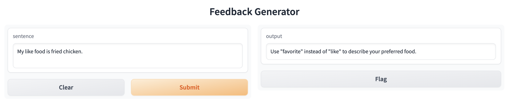

# Feedback Generation with Successive Prompts

This is a mini-project to get familiar with the [LangChain](https://python.langchain.com/en/latest/) library.

This program uses GPT-4 to generate corrective feedback comments on input sentences by first correcting the sentence, then commenting on the source-correction pair. We use `SequentialChain` to pass the input and output information between the two prompt templates.

The grammatical error correction prompt is based on the best-performing prompt in ["An Analysis of GPT-3's Performance in Grammatical Error Correction" (Coyne and Sakaguchi, 2023)](https://arxiv.org/abs/2303.14342).

A simple demo, as seen below, is given using Gradio.

